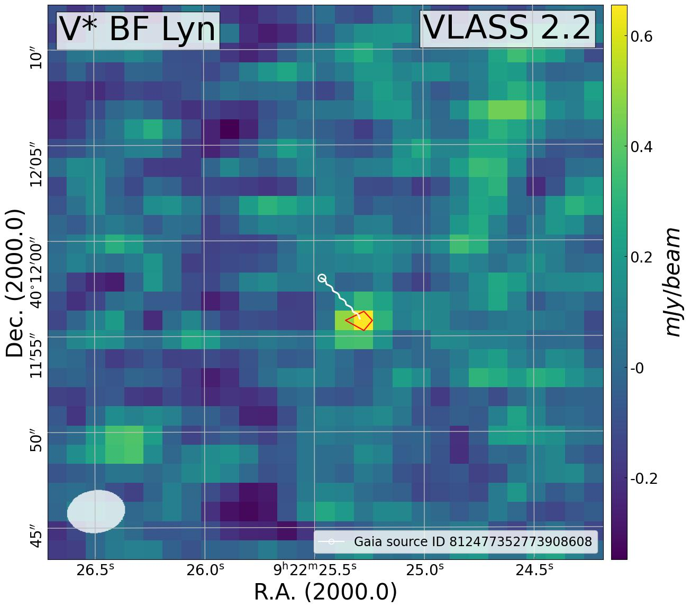

## Example

Although no definitive results can be shown at this moment, an example star, **BF Lyn**, is provided. Using the traditional **Catalog Method**, this star would be missed because no matching radio source is found in the FIRST catalog. However, using the **Image Method**, it is identified as a potential radio-emitting star.

  
